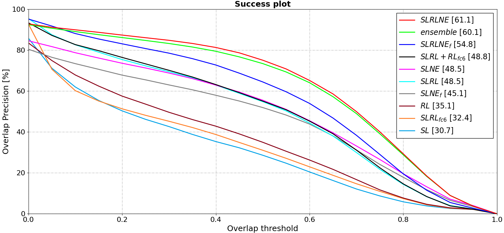
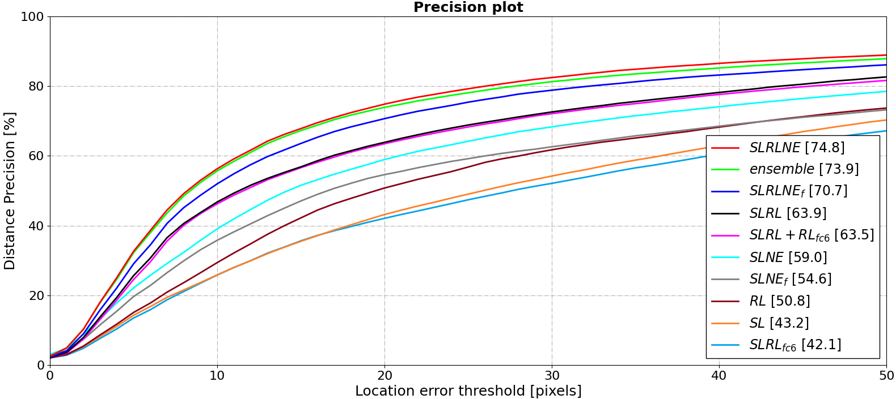

# NEOTracker

NEOTracker is an object tracking system that leverages neuroevolution (NE) to optimize neural network weights through evolutionary algorithms. This tracker builds on the previous work of ADNet, a reinforcement learning based tracker. Neuroevolution has shown promising results in tackling complex tasks where reinforcement learning (RL) struggles, such as problems with sparse rewards and partial observability.

Visual object tracking - keeping track of objects throughout video sequences - is a longstanding computer vision challenge that shares key characteristics with game-playing tasks when formulated in the way that ADNet does. This makes it potentially well-suited for neuroevolution techniques.

In this project, the controller networks, responsible for sampling actions to move the bounding box, are the components being evolved through neuroevolution. These controller networks receive features from pre-trained backbone networks, which were trained using supervised learning and reinforcement learning. This compromise of using pre-trained backbones is necessary due to the substantial computational resources required for training the entire architecture end-to-end with neuroevolution, making it infeasible with the hardware that was used to train these models.

## Key Features

- Compares the performance of NE and RL for visual object tracking on the OTB-100 benchmark and a custom synthetic dataset
- Explores transfer learning strategies applied to the NE training process
- Investigates using an ensemble of diverse NE-trained networks for more robust predictions
- Analyzes the impact of different backbone architectures for feature representation

## Motivation

This project aims to determine if NE can achieve a similar level of competitiveness for visual object tracking as it has for game-playing when directly compared to RL approaches. It also examines leveraging NE's diverse, exploratory nature through ensembles and studies accelerating convergence via transfer learning.

## Results

On benchmark evaluations, the NE tracker outperformed RL-based trackers, demonstrating NE's promise for this domain. Analyzing the synthetic benchmark revealed interesting differences in the learned policies and movement strategies between NE and RL models. Backbone architectures significantly impacted performance across both approaches. Initializing NE populations with pretrained weights accelerated convergence.

While ensembling did not improve performance in these experiments, the project identifies potential areas like optimized ensemble selection strategies to further boost NE's capabilities for robust visual object tracking.

## Models and Benchmark Results
| Configuration            | Description                                                                                                                                                                         |
| ------------------------ | :---------------------------------------------------------------------------------------------------------------------------------------------------------------------------------- |
| $\text{SL}$                       | Supervised learning only.                                                                                                                                                           |
| $\text{RL}$            | Reinforcement learning only.                                                                                                                                                        |
| $\text{SLRL}$                    | Supervised learning + Reinforcement learning.                                                                                                                                       |
| $\text{SLRL}_{fc6}$      | Supervised learning + Reinforcement learning applied to the last layer only.                                                                                                        |
| $SLRL + \text{RL}_{fc6}$ | Supervised learning + Reinforcement learning; the backbone is frozen and the last layer is retrained.                                                                               |
| $\text{SLNE}$                    | Supervised learning + Neuroevolution; the last layer is randomly initialized.                                                                                                       |
| $\text{SLNE}_{f}$        | Supervised learning + Neuroevolution; the last layer is initialised around $fc_6$ from the SL training (transfer learning).                                                         |
| $SLRLNE$                 | Supervised learning + Reinforcement learning + Neuroevolution; uses the $SLRL$ backbone and the last layer is randomly initialised.                                                 |
| $\text{SLRLNE}_{f}$      | Supervised learning + Reinforcement learning + Neuroevolution; uses the $SLRL$ backbone and the last layer is initialised around $fc_6$ from the SLRL training (transfer learning). |

### OTB Benchmark

